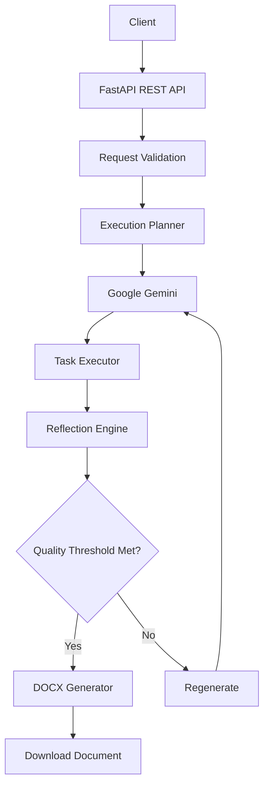
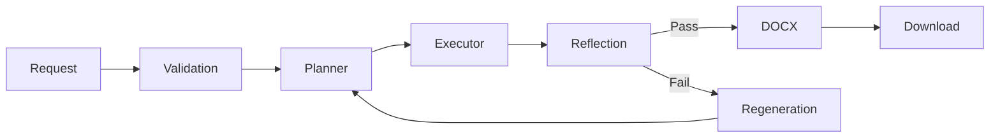

<div align="center">

# 🤖 Autonomous AI Agent

### AI-powered autonomous workflow engine for planning, execution, reflection, regeneration, and professional Microsoft Word document generation.

<p align="center">
  

  

  

  

  
</p>

<p align="center">
  <a href="#-installation">Installation</a> •
  <a href="#-usage">Usage</a> •
  <a href="#-api-reference">API</a> •
  <a href="#-docker">Docker</a> •
  <a href="#-testing">Testing</a>
</p>

**Autonomously converts natural language requests into structured execution plans, evaluates results through AI reflection, regenerates when necessary, and delivers professional Microsoft Word documents through a single FastAPI endpoint.**

</div>

---
## 🚀 Highlights

- 🤖 Autonomous AI-powered document generation
- 🧠 Reflection & regeneration workflow
- ⚡ FastAPI REST API
- 📄 Professional Microsoft Word (.docx) output
- 🐳 Docker-ready deployment
- 🧪 Automated testing with Pytest
- 📚 Interactive Swagger & ReDoc documentation


---
## 📚 Table of Contents

- [📌 Overview](#-overview)
- [✨ Features](#-features)
- [🛠️ Tech Stack](#️-tech-stack)
- [🏗️ Architecture](#️-architecture)
- [📂 Project Structure](#-project-structure)
- [🚀 Installation](#-installation)
- [⚙️ Configuration](#️-configuration)
- [📖 Usage](#-usage)
- [🌐 API Reference](#-api-reference)
- [🐳 Docker](#-docker)
- [🧪 Testing](#-testing)
- [🛣️ Roadmap](#️-roadmap)
- [🤝 Contributing](#-contributing)
- [📄 License](#-license)
- [👨‍💻 Author](#-author)

---
## 📌 Overview

Autonomous AI Agent is a production-ready backend application that transforms natural language requests into structured, high-quality Microsoft Word documents through an autonomous AI workflow.

Unlike traditional AI applications that generate a single response, this system follows a multi-stage execution pipeline. It first analyzes the user's request, creates an execution plan, performs each task, evaluates the generated output through an AI-powered reflection mechanism, regenerates the content when quality requirements are not met, and finally produces a professionally formatted `.docx` document.

The entire workflow is exposed through a single REST API built with **FastAPI**, enabling seamless integration into web applications, enterprise systems, and AI-powered automation pipelines.

### Workflow

1. Receive a natural language request.
2. Generate a structured execution plan using Google Gemini.
3. Execute each planned task.
4. Evaluate the generated content using an AI reflection agent.
5. Regenerate the output if it does not satisfy the quality threshold.
6. Generate a professionally formatted Microsoft Word document.
7. Return the generated document to the client.

> **Example Request**

```json
{
  "request": "Create a business proposal for an AI healthcare chatbot."
}
```

> **Output**

```text
📄 create_a_business_proposal_for_an_ai_healthcare_chatbot.docx
```

---
## 📊 Project Statistics

| Metric | Value |
|---------|-------|
| Language | Python 3.13 |
| Framework | FastAPI |
| API Style | REST |
| AI Model | Google Gemini |
| Output Format | Microsoft Word (.docx) |
| Containerized | Docker |
| Documentation | Swagger + ReDoc |
| License | MIT |

---
## ✨ Features

- 🧠 **Autonomous Planning** — Converts natural language requests into structured execution plans using Google Gemini.
- ⚙️ **Task-Based Execution** — Executes each planned task sequentially through a modular execution pipeline.
- 🔍 **AI Reflection Engine** — Evaluates generated content against quality criteria before producing the final output.
- 🔄 **Automatic Regeneration** — Regenerates responses when the reflection engine determines the quality threshold has not been met.
- 📄 **Professional DOCX Generation** — Produces well-structured Microsoft Word documents with headings, sections, and formatting.
- 🚀 **FastAPI REST API** — Exposes the complete autonomous workflow through a simple REST endpoint.
- 🐳 **Docker Support** — Ready for containerized deployment using Docker and Docker Compose.
- 📝 **Comprehensive Logging** — Includes structured logging for monitoring, debugging, and troubleshooting.
- ✅ **Input Validation** — Uses Pydantic models to validate requests and ensure reliable API behavior.
- 🧪 **Test Coverage** — Includes automated unit tests for core components to maintain reliability.
- 📚 **Interactive API Documentation** — Swagger UI and ReDoc are automatically generated by FastAPI.
- ⚡ **Production-Ready Architecture** — Modular project structure designed for scalability and maintainability.

> [!TIP]
> The application is designed to be easily extensible. New planners, executors, reflection strategies, or output formats can be integrated without major architectural changes.

---
## 🛠️ Tech Stack

| Category | Technologies |
|----------|--------------|
| **Programming Language** |  |
| **Backend Framework** |   |
| **AI & LLM** |  |
| **Data Validation** |  |
| **Document Generation** |  |
| **Configuration** |  |
| **Logging** |   |
| **Testing** |  |
| **API Documentation** |   |
| **Containerization** |   |
| **Version Control** |   |

---
## 🏗️ Architecture

The project follows a modular architecture where each component has a single responsibility. The API receives a user's request, generates an execution plan using Google Gemini, executes the plan, evaluates the generated content through an AI reflection mechanism, regenerates the output when necessary, and finally produces a professionally formatted Microsoft Word document.



> [!NOTE]
> The reflection and regeneration loop improves output quality by automatically re-evaluating and regenerating content until the configured quality threshold is satisfied.

### Components

| Component | Responsibility |
|-----------|----------------|
| **FastAPI API** | Receives requests, validates input, and coordinates the workflow. |
| **Planner** | Converts the user's natural language request into a structured execution plan. |
| **Google Gemini** | Powers planning, content generation, and regeneration. |
| **Executor** | Executes each task defined in the execution plan. |
| **Reflection Engine** | Evaluates generated content against quality criteria. |
| **Regeneration** | Recreates content when the reflection engine requests improvements. |
| **DOCX Generator** | Produces the final professionally formatted Microsoft Word document. |

---
## 📂 Project Structure

```text
autonomous-ai-agent/
│
├── agent/                 # AI planning, execution, reflection, and regeneration
│
├── api/                   # Request and response models
│
├── cache/                 # Generated cache files
│
├── core/                  # Configuration, logging, and exception handling
│
├── docs/                  # Project documentation
│
├── output/                # Generated Microsoft Word documents
│
├── prompts/               # Prompt templates for AI workflows
│
├── tests/                 # Unit tests
│
├── app.py                 # FastAPI application entry point
├── Dockerfile             # Docker image configuration
├── docker-compose.yml     # Docker Compose configuration
├── requirements.txt       # Project dependencies
├── .env.example           # Environment variables template
└── README.md              # Project documentation
```

### Directory Overview

| Directory/File | Description |
|----------------|-------------|
| **agent/** | Contains the core autonomous workflow, including planning, execution, reflection, regeneration, and document generation. |
| **api/** | Defines request and response models using Pydantic. |
| **core/** | Centralized configuration, logging, and custom exception handling. |
| **prompts/** | Stores prompt templates used by Google Gemini during different workflow stages. |
| **tests/** | Automated unit tests for validating application components. |
| **docs/** | Additional project documentation, including deployment instructions. |
| **output/** | Stores generated Microsoft Word documents during execution. |
| **cache/** | Temporary cache files generated by the application. |
| **app.py** | Entry point that initializes the FastAPI application and API routes. |
| **Dockerfile** | Defines the Docker image used for containerized deployment. |
| **docker-compose.yml** | Simplifies local deployment using Docker Compose. |
| **requirements.txt** | Lists all Python dependencies required by the project. |

> [!NOTE]
> The project follows a modular architecture where each directory has a single responsibility, making the codebase easier to maintain, test, and extend.

---
## 🚀 Installation

### Prerequisites

Before running the project, ensure you have the following installed:

- Python **3.13** or later
- Git
- Docker & Docker Compose *(optional, for containerized deployment)*

---

### 1. Clone the Repository

```bash
git clone https://github.com/Aryan1021/autonomous-ai-agent.git
cd autonomous-ai-agent
```

---

### 2. Create a Virtual Environment

#### Windows

```bash
python -m venv .venv
.venv\Scripts\activate
```

#### Linux / macOS

```bash
python3 -m venv .venv
source .venv/bin/activate
```

---

### 3. Install Dependencies

```bash
pip install --upgrade pip
pip install -r requirements.txt
```

---
### Verify Installation

Run the test suite to verify that the project has been installed correctly.

```bash
pytest
```

Expected output:

```text
==============================
All tests passed successfully
==============================
```

---

### 4. Configure Environment Variables

Create a `.env` file in the project root.

```bash
cp .env.example .env
```

> **Windows (Command Prompt)**

```cmd
copy .env.example .env
```

Update the following variables:

```env
GEMINI_API_KEY=your_api_key_here
PRIMARY_MODEL=gemini-2.5-flash
```

---

### 5. Run the Application

```bash
uvicorn app:app --reload
```

The API will be available at:

- **API:** http://127.0.0.1:8000
- **Swagger UI:** http://127.0.0.1:8000/docs
- **ReDoc:** http://127.0.0.1:8000/redoc

---

### Running with Docker

Build and start the application using Docker Compose:

```bash
docker compose up --build
```

Once the container is running, access the application at:

- **API:** http://127.0.0.1:8000
- **Swagger UI:** http://127.0.0.1:8000/docs
- **ReDoc:** http://127.0.0.1:8000/redoc

> [!TIP]
> For the quickest setup, use **Docker Compose**. It automatically builds the application and starts all required services with a single command.

---
## ⚙️ Configuration

The application is configured using environment variables. Copy the provided `.env.example` file to `.env` and update the required values before starting the application.

```bash
cp .env.example .env
```

### Environment Variables

| Variable | Required | Default | Description |
|----------|:--------:|---------|-------------|
| `GEMINI_API_KEY` | ✅ | — | Google Gemini API key used for AI-powered planning, execution, reflection, and regeneration. |
| `PRIMARY_MODEL` | ✅ | `gemini-2.5-flash` | Primary Gemini model used throughout the workflow. |
| `FALLBACK_MODELS` | ❌ | `gemini-2.5-flash-lite` | Comma-separated list of fallback models used if the primary model is unavailable. |
| `TEMPERATURE` | ❌ | `0.3` | Controls response randomness. Lower values produce more deterministic outputs. |
| `MAX_RETRIES` | ❌ | `3` | Maximum number of retries for failed AI requests. |
| `REQUEST_TIMEOUT` | ❌ | `60` | Maximum request timeout (in seconds) for AI model responses. |
| `ENABLE_REFLECTION` | ❌ | `true` | Enables AI-powered reflection and quality evaluation before generating the final document. |
| `LOG_LEVEL` | ❌ | `INFO` | Sets the application logging level. (`DEBUG`, `INFO`, `WARNING`, `ERROR`) |
| `LOG_FILE` | ❌ | `logs/app.log` | Path to the application log file. |

### Example Configuration

```env
GEMINI_API_KEY=your_api_key_here

PRIMARY_MODEL=gemini-2.5-flash
FALLBACK_MODELS=gemini-2.5-flash-lite

TEMPERATURE=0.3
MAX_RETRIES=3
REQUEST_TIMEOUT=60

ENABLE_REFLECTION=true

LOG_LEVEL=INFO
LOG_FILE=logs/app.log
```

> [!IMPORTANT]
> Never commit your `.env` file or API keys to GitHub. Only commit `.env.example`, which contains placeholder values.

---
## 📖 Usage

Once the application is running, you can interact with the API using **Swagger UI**, **ReDoc**, or any HTTP client such as Postman, Insomnia, or cURL.

## Available Endpoints

| Resource | URL |
|----------|-----|
| **API Base URL** | http://127.0.0.1:8000 |
| **Swagger UI** | http://127.0.0.1:8000/docs |
| **ReDoc** | http://127.0.0.1:8000/redoc |

> [!TIP]
> During development, **Swagger UI** is the quickest way to test the API without writing any client code.

---

## Generate a Document

To generate a professional Microsoft Word document, send a **POST** request to the following endpoint:

```http
POST /api/v1/agent HTTP/1.1
Host: localhost:8000
Content-Type: application/json
```

### Request Body

```json
{
  "request": "Create a business proposal for an AI healthcare chatbot."
}
```

---

## Example using cURL

```bash
curl -X POST "http://127.0.0.1:8000/api/v1/agent" \
-H "Content-Type: application/json" \
-d '{
      "request": "Create a business proposal for an AI healthcare chatbot."
    }'
```

---

## Processing Workflow

After receiving the request, the Autonomous AI Agent performs the following steps:

1. Validates the incoming request.
2. Generates a structured execution plan using Google Gemini.
3. Executes each task in the generated plan.
4. Evaluates the generated content using the AI Reflection Engine.
5. Regenerates the content if the quality threshold is not met.
6. Produces a professionally formatted Microsoft Word document.
7. Returns the generated document to the client.



---

## Successful Response

If the request is processed successfully, the API returns:

| Property | Value |
|----------|-------|
| **Status Code** | `200 OK` |
| **Content-Type** | `application/vnd.openxmlformats-officedocument.wordprocessingml.document` |
| **Response** | Downloadable Microsoft Word (`.docx`) document |

> [!NOTE]
> The API returns a downloadable **Microsoft Word (`.docx`) document** instead of a JSON response.

---

## Example Output

```text
output/
└── create_a_business_proposal_for_an_ai_healthcare_chatbot.docx
```

The generated document contains professionally formatted content with headings, sections, and structured information based on the user's request.

---

## Error Handling

If a request cannot be processed, the API returns an appropriate HTTP status code.

| Status Code | Description |
|-------------|-------------|
| **400 Bad Request** | Invalid request payload or missing required fields. |
| **422 Unprocessable Entity** | Request validation failed. |
| **500 Internal Server Error** | An unexpected server error occurred while processing the request. |

> [!IMPORTANT]
> Ensure that your `GEMINI_API_KEY` is configured correctly in the `.env` file before sending requests to the API.

---
## 🌐 API Reference

The Autonomous AI Agent exposes a RESTful API built with **FastAPI**. Interactive API documentation is automatically available through Swagger UI and ReDoc.

### Interactive Documentation

| Documentation | URL |
|--------------|-----|
| **Swagger UI** | http://127.0.0.1:8000/docs |
| **ReDoc** | http://127.0.0.1:8000/redoc |

---

## Endpoint

### Generate Document

| Method | Endpoint | Description |
|--------|----------|-------------|
| `POST` | `/api/v1/agent` | Generates a professional Microsoft Word document from a natural language request. |

---

### Request

```http
POST /api/v1/agent HTTP/1.1
Host: localhost:8000
Content-Type: application/json
```

#### Request Body

```json
{
  "request": "Create a business proposal for an AI healthcare chatbot."
}
```

---

### Successful Response

| Status Code | Description |
|-------------|-------------|
| **200 OK** | Successfully generated and returned a Microsoft Word (`.docx`) document. |

**Response Headers**

| Header | Value |
|--------|-------|
| **Content-Type** | `application/vnd.openxmlformats-officedocument.wordprocessingml.document` |
| **Content-Disposition** | `attachment; filename="generated_document.docx"` |

> [!NOTE]
> The API returns a downloadable **Microsoft Word (`.docx`) document** rather than a JSON response.

---

### Error Responses

| Status Code | Description |
|-------------|-------------|
| **400 Bad Request** | Invalid request payload or missing required fields. |
| **422 Unprocessable Entity** | Request validation failed. |
| **500 Internal Server Error** | An unexpected server error occurred while processing the request. |

---

### Processing Pipeline

```text
Request
   │
   ▼
Input Validation
   │
   ▼
Execution Planning
   │
   ▼
Task Execution
   │
   ▼
AI Reflection
   │
   ├── Pass ─────────────► Generate DOCX
   │
   └── Fail ─► Regenerate ─► Reflect Again
                          │
                          ▼
                 Return Document
```

> [!TIP]
> Use **Swagger UI** (`/docs`) for interactive testing and **ReDoc** (`/redoc`) for complete API documentation.

---
## 🐳 Docker

The Autonomous AI Agent can be deployed using Docker, providing a consistent and isolated runtime environment across different operating systems.

## Prerequisites

- Docker
- Docker Compose (v2 or later)

Verify your installation:

```bash
docker --version
docker compose version
```

---

## Build the Docker Image

```bash
docker build -t autonomous-ai-agent .
```

---

## Run the Container

```bash
docker run \
-p 8000:8000 \
--env-file .env \
autonomous-ai-agent
```

The application will be available at:

| Service | URL |
|---------|-----|
| API | http://localhost:8000 |
| Swagger UI | http://localhost:8000/docs |
| ReDoc | http://localhost:8000/redoc |

---

## Using Docker Compose

Build and start the application:

```bash
docker compose up --build
```

Run in detached mode:

```bash
docker compose up -d
```

Stop the application:

```bash
docker compose down
```

---

## Rebuilding After Changes

Whenever dependencies or the Dockerfile change, rebuild the image:

```bash
docker compose up --build
```

---

## Container Workflow

```text
Source Code
      │
      ▼
Docker Build
      │
      ▼
Docker Image
      │
      ▼
Docker Container
      │
      ▼
FastAPI Application
      │
      ▼
Swagger / ReDoc / API
```

> [!TIP]
> Docker ensures a reproducible development and deployment environment by packaging the application together with all required dependencies.

---

## 🧪 Testing

The project includes automated tests to verify the reliability and correctness of the autonomous workflow. Tests are written using **Pytest** and are designed to validate individual components independently.

## Test Framework

- **Framework:** Pytest
- **Language:** Python 3.13
- **Test Type:** Unit Tests
- **Execution:** Local & CI Compatible

---

## Running All Tests

Execute the complete test suite:

```bash
pytest
```

Run tests with verbose output:

```bash
pytest -v
```

Run a specific test file:

```bash
pytest tests/test_planner.py
```

Run a specific test function:

```bash
pytest tests/test_planner.py::test_generate_plan
```

---

## Expected Output

A successful test execution will produce output similar to:

```text
==============================
All tests passed successfully
==============================
```

> **Note:** The number of tests may increase as the project evolves.

---

## Test Structure

```text
tests/
├── test_planner.py
├── test_executor.py
├── test_reflection.py
├── test_models.py
└── ...
```

Each test module focuses on a single component, making the test suite easier to maintain and extend.

---

## What Is Tested?

The current test suite validates:

- Execution plan generation
- Request and response validation
- Reflection engine behavior
- Regeneration workflow
- Error handling
- Configuration loading
- Pydantic models
- API response integrity

---

## Writing New Tests

When adding new features:

1. Create a new test file inside the `tests/` directory.
2. Follow the existing naming convention (`test_<module>.py`).
3. Keep each test focused on a single behavior.
4. Ensure all tests pass before committing changes.

---

## Continuous Integration

The test suite is designed to run automatically in Continuous Integration (CI) pipelines, ensuring that every change is validated before deployment.

> [!TIP]
> Run the full test suite before creating a pull request or releasing a new version to ensure the application remains stable.

---

## 🛣️ Roadmap

The project is actively evolving. The following roadmap outlines completed milestones and planned enhancements.

## Completed

- [x] FastAPI REST API
- [x] Google Gemini integration
- [x] Autonomous execution planning
- [x] Task execution pipeline
- [x] AI reflection engine
- [x] Automatic regeneration workflow
- [x] Microsoft Word (.docx) generation
- [x] Environment-based configuration
- [x] Structured logging
- [x] Pydantic request validation
- [x] Docker support
- [x] Automated testing
- [x] Interactive Swagger & ReDoc documentation

---

## In Progress

- [ ] Improve reflection evaluation strategy
- [ ] Increase unit test coverage
- [ ] Performance optimization
- [ ] Enhanced logging and monitoring

---

## Planned Features

### AI Improvements

- [ ] Multi-model LLM support
- [ ] Dynamic model selection
- [ ] Custom prompt templates
- [ ] User-defined quality thresholds

---

### Document Generation

- [ ] PDF export
- [ ] PowerPoint (.pptx) export
- [ ] Markdown export
- [ ] HTML export
- [ ] Rich document templates

---

### API Enhancements

- [ ] Authentication & Authorization
- [ ] API versioning
- [ ] Rate limiting
- [ ] Request history
- [ ] Background task processing

---

### DevOps

- [ ] GitHub Actions CI
- [ ] Code coverage reports
- [ ] Automated Docker image publishing
- [ ] Automated release workflow

---

### Future Vision

The long-term goal of this project is to evolve from a single autonomous document-generation agent into a modular AI agent platform capable of planning, executing, evaluating, and generating multiple types of professional outputs through extensible workflows.

> [!NOTE]
> Contributions and feature suggestions are always welcome. Check the **Contributing** section to learn how you can get involved.

---

## 🤝 Contributing

Contributions are welcome! Whether you're fixing a bug, improving documentation, or proposing a new feature, your help is appreciated.

## How to Contribute

1. Fork the repository.
2. Create a new feature branch.

```bash
git checkout -b feature/your-feature-name
```

3. Make your changes.
4. Ensure the project builds successfully and all tests pass.

```bash
pytest
```

5. Commit your changes using a descriptive commit message.

```bash
git commit -m "feat: add document export support"
```

6. Push your branch.

```bash
git push origin feature/your-feature-name
```

7. Open a Pull Request using the provided Pull Request template and describe your changes clearly.

---

## Contribution Guidelines

- Follow the existing project structure.
- Keep functions focused and modular.
- Add or update tests when introducing new functionality.
- Update documentation if behavior changes.
- Use clear and descriptive commit messages.

> [!TIP]
> Before submitting a Pull Request, ensure the application runs successfully and all tests pass.

---
## 📄 License

This project is licensed under the **MIT License**.

See the [LICENSE](LICENSE) file for the complete license text.

---
## 👨‍💻 Author

Developed and maintained by **Aryan Raj**.

---

<div align="center">

Built with ❤️ using **Python**, **FastAPI**, and **Google Gemini**

⭐ If you found this project useful, consider giving it a star!

</div>